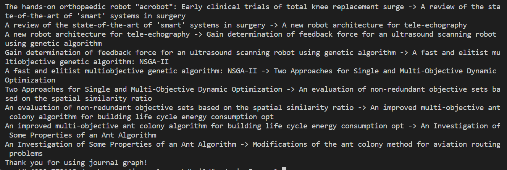
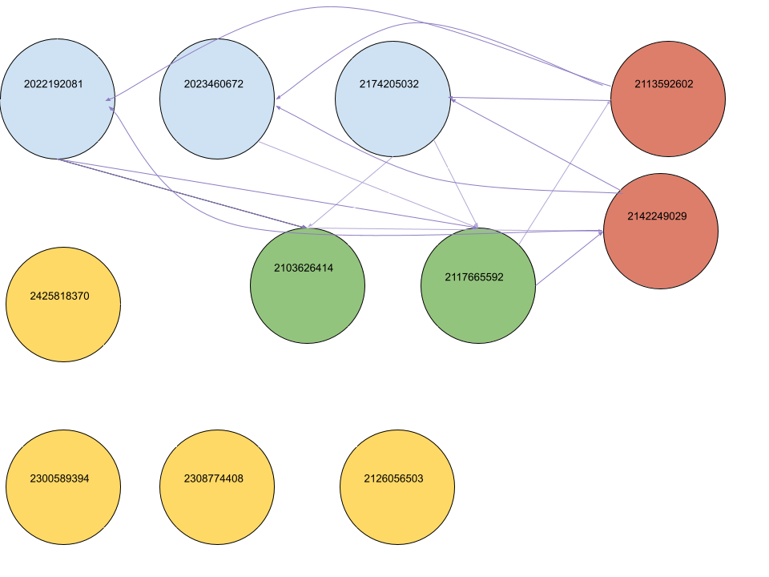
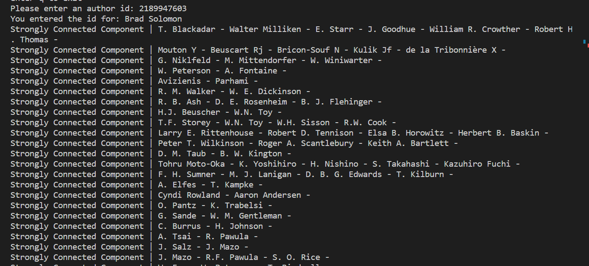

# Aminer Citation Network Analysis Tool

### Research Question
What are the relations between research faculty and their publications? Are there any patterns in terms of common research areas or geographical locality/similar institutions when it comes to collaboration trends.

### Results

-A: Database
    Perhaps the most critical bottleneck within our project was the large amounts of data. Getting 12GB of json to process in a Docker Container was a long an arduous task. We got it to work, however, by using a B+Tree based flat file database, which organizes important information in each line as a B+Tree with values at the leaf nodes, and stores them as binary in a file. Doing this reduced the amount of space the data took from 12GB to 2GB, greatly reducing overhead. Furthermore, it achieved a speedup of around 10,000x in respect to the nlohmann::json parsing library to 15 seconds by taking advantage of the cache. Finally, it also had important properties like find and insert, which are important for the data in the graphs to be useful. Each property was tested using an example dataset in the catch_tests directory. Examples of it being in use are output examples below which use names. Graphs were traversed by id, and each id was converted to a name or paper.

-B: DFS
    We ran DFS on the journal graph as a heuristic for generating the ideation history of a certain paper. Because a paper can only reference papers from the past, the entire structure of the journal graph can be considered a forest. As such, doing a dfs goes on a straight path to the root, which results in quite interesting revelations. An example can be found here: 
    
    Tests were done on DFS by ensuring that each result is indeed a connected, DFS path to the root. The code for this is available in catch_tests. Due to the structure of the graph, this should be sufficient in proving a valid DFS traversal.
 
 
 
-C: Dijkstra's
    We ran Dijkstra's algorithm on the author algorithm as a hueristic for generating relevant articles given two others. Ultimately, we found that it was not as effective as the others, most likely due to the idea that the graph can be relatively disconnected. Often times, it will not return anything implying that there is no path. However, it was tested extensively using pre-built data. An example is the tarjanstest.json file which also works for Dijkstras. A visualization is shown here:
    
 
    It correctly outputs the path along the three blue nodes, 2113592602 as the destination, for a path length of 4.
    The same can be said for the path from 2022192081 to 2117665592, of which the weighting causes it to traerse one blue, then to the green for a path length of two.
 

-D: Tarjan's
    We ran Tarjan's algorithm on the author graph for a given node as a way to see clusters of researchers. This proved quite effective, consistently generating large amounts of clusters for multiple inputs. The following cluster can be observed for Brad Solomon as the input
     
    
    Each of these SCCs are clusters of related researchers, whether by publication of citation. Interestingly, we also found that related researchers also tended to have related SCCs. For instance, both Brad Solomon and Carl Evans had the SCC with T. Blackadar et al. Further unit tests were performed with the know set shown for Dijkstra's, as well as by affirming that each SCC is connected through dfs.

-E: Miscellaneous Implementations
    Alongside our primary deliverables, we also implemented an interface for browsing the database, as well as a small paper game to see if two papers are connected using BFS. These are both done primarily as a way to quench one's inquisitiveness. It can also be used to research about any author, as it provides a get_neighbors function as a sort of manual traversal.

### Takeaways
    Using our results, we were able to extrapolate multiple conclusions regarding our research question. DFS was a proof of concept that papers can be traced path to ideation following their citations. For instance, someone interested in surgical robots might want to study the theory of the ant colony method as implied by the DFS example. Tarjans was able to show that 1. similar faculty share similar connected clusters (Like Brad's and Carl's), and 2. authors are often connected by chains of intimitely related faculty. Finally, the database was a proof of concept that, indeed, while tough to implement, 12GB of data is indeed usable on the CS225 Docker Container under a lot of optimization.

